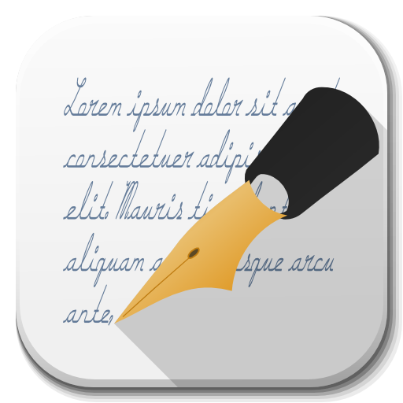

<!--
*** Thanks for checking out the Best-README-Template. If you have a suggestion
*** that would make this better, please fork the repo and create a pull request
*** or simply open an issue with the tag "enhancement".
*** Thanks again! Now go create something AMAZING! :D
***
***
***
*** To avoid retyping too much info. Do a search and replace for the following:
*** github_username, repo_name, twitter_handle, email, project_title, project_description
-->


<!-- PROJECT SHIELDS -->
<!--
*** I'm using markdown "reference style" links for readability.
*** Reference links are enclosed in brackets [ ] instead of parentheses ( ).
*** See the bottom of this document for the declaration of the reference variables
*** for contributors-url, forks-url, etc. This is an optional, concise syntax you may use.
*** https://www.markdownguide.org/basic-syntax/#reference-style-links
-->
[![Contributors][contributors-shield]][contributors-url]
[![Forks][forks-shield]][forks-url]
[![Stargazers][stars-shield]][stars-url]
[![Issues][issues-shield]][issues-url]
[![MIT License][license-shield]][license-url]


<!-- PROJECT LOGO -->
<br />
<p align="center">
  <a href="https://github.com/antman313/Zitate">
    
  </a>

  <h3 align="center">My little Quote (Zitate) Project</h3>

  <p align="center">
    project_description
    <br />
    <a href="https://github.com/antman313/Zitate"><strong>Explore the docs »</strong></a>
    <br />
    <br />
    <a href="https://github.com/antman313/Zitate">View Demo</a>
    ·
    <a href="https://github.com/antman313/Zitate/issues">Report Bug</a>
    ·
    <a href="https://github.com/antman313/Zitate/issues">Request Feature</a>
  </p>
</p>

<!-- TABLE OF CONTENTS -->
<details open="open">
  <summary><h2 style="display: inline-block">Table of Contents</h2></summary>
  <ol>
    <li>
      <a href="#about-the-project">About The Project</a>
      <ul>
        <li><a href="#built-with">Built With</a></li>
      </ul>
    </li>
    <li>
      <a href="#getting-started">Getting Started</a>
      <ul>
        <li><a href="#installation">Installation</a></li>
      </ul>
    </li>
    <li><a href="#usage">Usage</a></li>
    <li><a href="#roadmap">Roadmap</a></li>
    <li><a href="#contributing">Contributing</a></li>
    <li><a href="#license">License</a></li>
    <li><a href="#contact">Contact</a></li>
  </ol>
</details>


<!-- ABOUT THE PROJECT -->
## About The Project

[![Product Name Screen Shot][product-screenshot]](https://example.com)

**Genaue Beschreibung folgt noch**

### Built With

+ Delphi 10.3.3
+ PHP
+ MySQL(MariaDB)
+ RESTApi from http://wiseloop.com/product/php-rest-services (Buy it at: https://codecanyon.net/item/php-rest-services-/4750857)

<!-- GETTING STARTED -->
## Getting Started

To get a local copy up and running follow these simple steps.
See the source code for all things to know.

Also you can play around here: https://api.fragandy.com/testapi.php/12345/zitate/v1/zitat.json
NOTE! You need a API access key to use it. Use the default at the Moment.

### Prerequisites

None at the Moment.

### Installation

1. Clone the repo
   ```sh
   git clone https://github.com/antman313/Zitate.git
   ```
2. Compile it with Delphi
3. Enjoy

<!-- ROADMAP -->
## Roadmap

See the [open issues](https://github.com/antman313/Zitate/issues) for a list of proposed features (and known issues).


<!-- CONTRIBUTING -->
## Contributing

Contributions are what make the open source community such an amazing place to be learn, inspire, and create. Any contributions you make are **greatly appreciated**.

1. Fork the Project
2. Create your Feature Branch (`git checkout -b feature/AmazingFeature`)
3. Commit your Changes (`git commit -m 'Add some AmazingFeature'`)
4. Push to the Branch (`git push origin feature/AmazingFeature`)
5. Open a Pull Request


<!-- LICENSE -->
## License

Distributed under the GNU License. See `LICENSE` for more information.

<!-- CONTACT -->
## Contact

Andreas Grzybowski - [https://nullfunktion.de](https://nullfunktion.de) - null@nullfunktion.de

Project Link: [https://github.com/antman313/Zitate](https://github.com/antman313/Zitate)


<!-- MARKDOWN LINKS & IMAGES -->
<!-- https://www.markdownguide.org/basic-syntax/#reference-style-links -->
[contributors-shield]: https://img.shields.io/github/contributors/antman313/repo.svg?style=for-the-badge
[contributors-url]: https://github.com/antman313/Zitate/graphs/contributors
[forks-shield]: https://img.shields.io/github/forks/antman313/repo.svg?style=for-the-badge
[forks-url]: https://github.com/antman313/Zitate/network/members
[stars-shield]: https://img.shields.io/github/stars/antman313/repo.svg?style=for-the-badge
[stars-url]: https://github.com/antman313/Zitate/stargazers
[issues-shield]: https://img.shields.io/github/issues/antman313/repo.svg?style=for-the-badge
[issues-url]: https://github.com/antman313/Zitate/issues
[license-shield]: https://img.shields.io/github/license/antman313/repo.svg?style=for-the-badge
[license-url]: https://github.com/antman313/Zitate/blob/master/LICENSE.txt
[product-screenshot]: screen.png